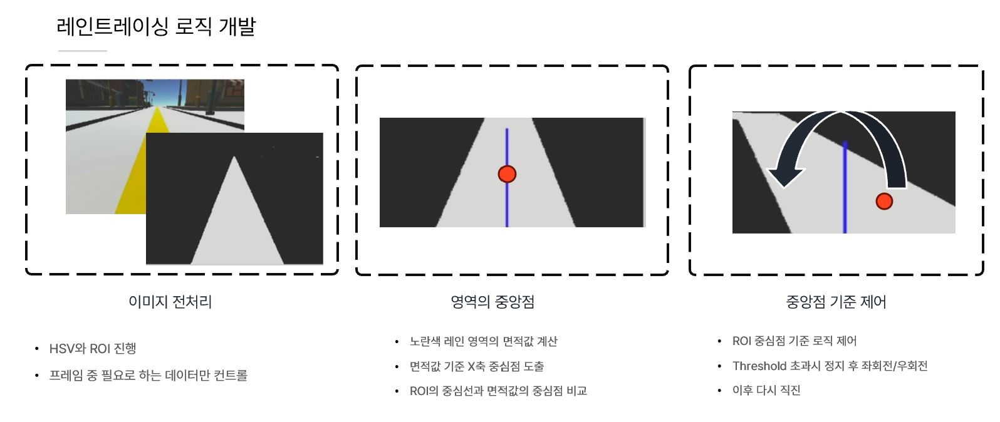
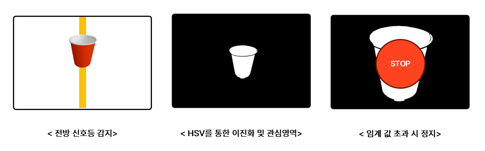

# AGV 제어 및 시뮬레이션 프로젝트


[](https://www.youtube.com/watch?v=pBbq8m0RX9M)


## 1. 목표 및 배경
### 목표    
- **Elephant Robotics MyAGV**를 이용한 **Lane Tracing**과 **Obstacle Avoidance**
- 최소 시간 트랙 완주를 위한 레인트레이싱 알고리즘 개발
- 기존 GUI를 통해서만 활성화 가능한 2D LiDAR를 launch에 포함
- 데이터 분석을 위한 RQT 파일 제공 


## 2. 시스템 아키텍처
본 프로젝트의 전체 시스템 아키텍처는 다음과 같이 구성됩니다

| 시스템 아키텍처 | 개발환경 아키텍처처 |
|------|------|
|  |  |

- 연산량이 많은 로직 코드는 **PC에서 실행**
-  **Cam, Laser Scan, IMU** 등의 **AGV 자체에서 필수적으로 발행**해야 하는 데이터들은 AGV에서 직접 처리

## 3. 레인 트레이싱(Lane Tracing) 로직
### LaneTracing Logic


| 설명 | 그림 |
|------|------|
| LaneTracing Logic |  |
| Obstacle Avoidance Logic |  |
| Traffic Light Logic |  |

### PID Controller


| PID 적용 | PID On | PID Off|
|------|------|------|
|  |  |  |

### RQT
| Simple RQT | RQT for data analysis |
|------|------|
|  |  |

## Unity ROS#
|  ROS Camera | Unity Camera | Unity Map|
|------|------|------|
|  |  |  |

## 4. AGV 사용법
### AGV 사용 전 유의 사항
#### 배터리 확인
- 배터리는 **90% 이상**을 정상 상태로 판단합니다.
##### GUI를 통한 확인
1. `operations.py` 실행 (MyAGV)
2. ```bash
   python3 ~/AGV_UI/operations.py
   ```
3. **Battery Info** 확인


### 1. Laser Scan Topic (MyAGV) 실행
```bash
cd ~/kairos_lane_tracing/agv_code
catkin_make
roslaunch agv_code mydata_cam.launch
```

### 2. Camera Topic (MyAGV) 실행
   ```bash
   python3 ~/test_cam_topic_roi.py
   ```

## 5. 설치 및 실행 방법

### 환경 설정 및 실행
1. **ROS 환경 설정**
   ```bash
   source /opt/ros/noetic/setup.bash
   ```
2. **패키지 빌드**
   ```bash
   cd src
   catkin_make
   ```
3. **AGV 제어 시스템 실행**

   ```bash
   # Lane Tracing with PID
   roslaunch kairos_lane_tracing pid_lane_tracing.launch
   ```

   ```bash
   # Obastacle Avoidance
   roslaunch kairos_lane_tracing pid_obstacle.launch
   ```


   ```bash
   # All in One Launchfile
   roslaunch kairos_lane_tracing test_all.launch
   ```

## 6. 기술 스택
- **프로그래밍 언어**: Python
- **프레임워크 및 라이브러리**: ROS Noetic, OpenCV, Unity ROS#
- **하드웨어 연동**: AGV 센서 및 모터 제어 API

## 7. 참고 자료
- [ROS 공식 문서](https://www.ros.org/)
- [OpenCV 공식 문서](https://opencv.org/)
- [Unity ML-Agents](https://github.com/Unity-Technologies/ml-agents)
- [Unity ROS#](https://github.com/siemens/ros-sharp)

